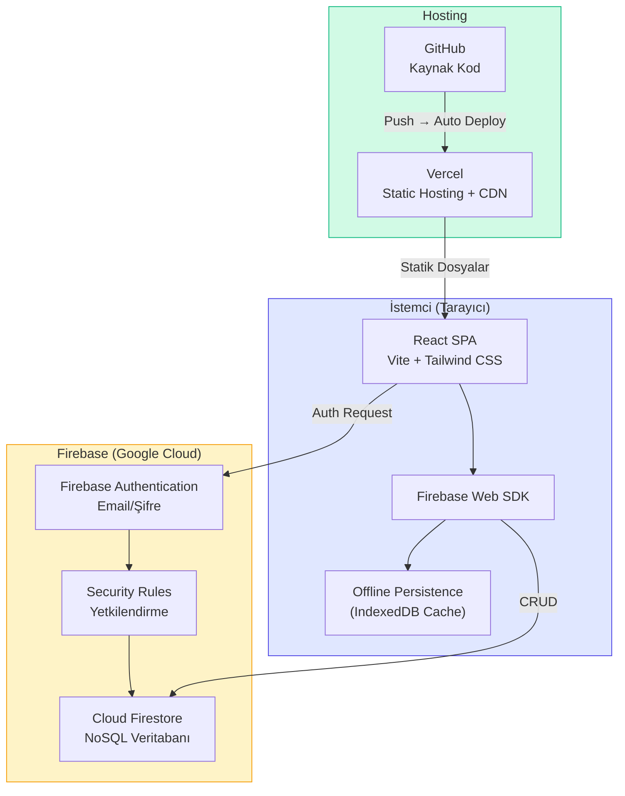
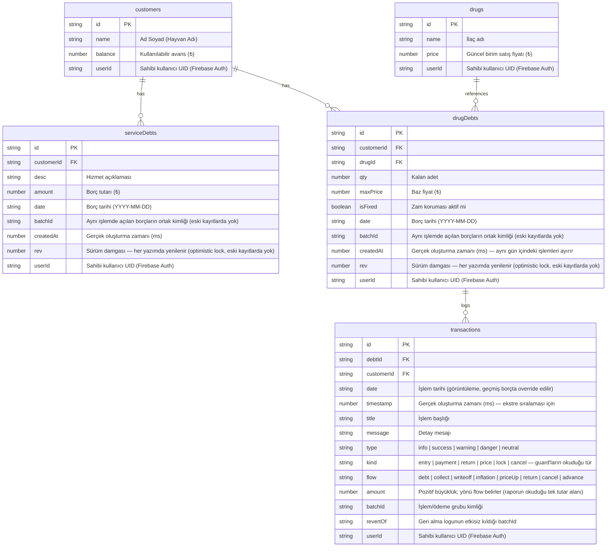
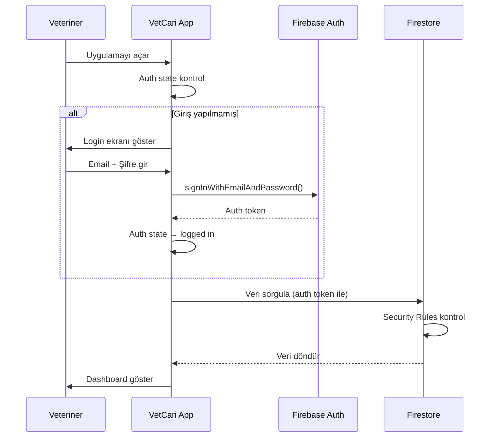
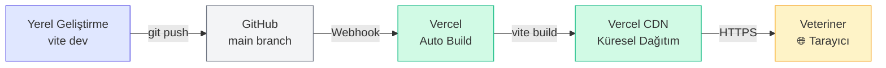

# VetCari Akıllı Defter — Mimari Dokümanı

> **Sürüm:** 1.8  
> **Son güncelleme:** 6 Eylül 2026  
> **Durum:** Üretimde. Faz 11 (dönemsel raporlama + CSV/PDF ekstre) tamamlandı; TASK-036 ile
> çoklu ilaç girişi arama tabanlı hale getirildi; 565 test.
> Kalan: TASK-022 (ilaç stok takibi), TASK-023 (TypeScript migrasyonu)

---

## 1. Projeye Genel Bakış

VetCari, veteriner klinikleri için geliştirilmiş **cari hesap takip** uygulamasıdır.  
Temel amacı müşteri borç/alacak yönetimini dijitalleştirmek ve **enflasyon korumalı ilaç borç takibi** sağlamaktır.

### Mevcut Özellikler
- Müşteri cari hesap yönetimi (borç/alacak/avans)
- Enflasyon korumalı ilaç borç takibi (fiyat sabitleme, otomatik güncelleme)
- Hizmet borçları (sabit TL cinsinden)
- Akıllı tahsilat dağıtım sistemi (önce hizmet → sonra ilaç oransal)
- Süpürücü mekanizması (10 TL altı küsüratları otomatik silme)
- İlaç iade yönetimi (fazla iade → avansa çevirme)
- Borç bazlı işlem geçmişi (ekstre/timeline)
- Dönemsel finansal raporlama (tahsilat / açılan borç / alacak değişimi, tarih aralığı seçimli)
- CSV cari ekstre dışa aktarma (Borç/Alacak/Bakiye düzeni, dönem seçimli, Excel tr-TR uyumlu)
- PDF cari ekstre (A4, gömülü Türkçe yazı tipi, çok sayfalı, müşteriye verilebilir)
- Geçmiş tarihli borç girişi (özel fiyat, kısmi tahsilat, enflasyon seçeneği)
- Toplu ilaç borcu ekleme (tek seferde N ilaç, orantılı tahsilat dağıtımı)
- Çok kullanıcı desteği (her kullanıcı kendi izole veritabanında çalışır)

### Planlanan Özellikler

**TypeScript Migrasyonu (TASK-023):** Incremental geçiş — `allowJs: true` ile başlanır, `strict: true` hedeflenir. Sıra: `src/types/index.ts` → servis → hook → context → component. Detaylar: [TASK.md](./TASK.md#task-023).

**Faz 11:**
- **İlaç stok takibi** (TASK-022): `drugs` koleksiyonuna `stock`/`minStock` alanı, otomatik düşüm, kritik eşik uyarısı
- **İlaç stok takibi** (TASK-022): `drugs` koleksiyonuna `stock`/`minStock` alanı, otomatik düşüm, kritik eşik uyarısı

---

## 2. İş Kuralları ve Algoritmalar

### Borç Tipleri

| Tip | Birim | Enflasyona Duyarlı | Canlı Hesaplama |
|-----|-------|---------------------|------------------|
| **Hizmet Borcu** | Sabit TL | ❌ Hayır | İşlem anındaki tutar korunur |
| **İlaç Borcu** | Adet / Kutu | ✅ Evet | `Güncel Borç = Kalan Adet × İlacın Güncel Fiyatı` |

### Fiyat Güncelleme Kuralları

- İlaç fiyatı **artırıldığında:** Sabitlenmemiş (kilitli olmayan) tüm ilaç borçlarının `maxPrice` değeri güncellenir, ekstre'ye "Zam" logu yazılır
- İlaç fiyatı **düşürüldüğünde:** Mevcut borçlar etkilenmez — `maxPrice` baz alınır (veteriner lehine iş kuralı)
- **Sabitlenmiş (kilitli)** borçlar: Hiçbir fiyat değişikliğinden etkilenmez

### Şelale (Waterfall) Tahsilat Algoritması

1. Kasaya giren tutar + müşterinin mevcut avansı bir **havuza** toplanır
2. **Adım 1:** Önce tüm sabit hizmet borçları sırayla kapatılır
3. **Adım 2:** Kalan havuz, açık ilaç borçlarına TL büyüklükleri oranında **oransal** dağıtılır
4. Sistem otomatik dağıtım önerisi sunar, veteriner dağıtım rakamlarını **manuel override** edebilir
5. İşlem sonrası kalan para müşteriye **avans** olarak yazılır

Her iki borç tipi (hizmet ve ilaç) için de tahsilat işlemi sırasında `Tahsilat` transaction logu yazılır. Süpürücü devreye girdiğinde ek bir `Süpürücü (Kapatıldı)` logu oluşturulur.

### Süpürücü (Sweeper) Algoritması

Tahsilat veya iade sonrası bir borcun güncel TL karşılığı **≤ 10 TL** ise:
- Sistem bu borcu mikro küsurat kabul eder ve **otomatik siler**
- Ekstre'ye "Süpürücü (Kapatıldı)" logu yazılır

### İade Kuralları

| Senaryo | Sonuç |
|---------|-------|
| İade adeti **≤** mevcut borç | Borçtan düşülür |
| İade adeti **>** mevcut borç | Borç kapatılır, fazla kısım `Fazla Adet × Güncel Fiyat` formülüyle **avansa** çevrilir |

### İlaç Silme Kuralı

- Aktif ilaç borcu olan ilaçlar **silinemez** (kullanıcıya uyarı gösterilir)
- Yalnızca hiçbir müşteride borcu kalmamış ilaçlar silinebilir

### Geçmiş Tarihli Borç Girişi

Veteriner geçmişte kağıt/hafızadan takip ettiği borçları sisteme girebilir:

- **Tarih geçersizleştirme (`dateOverride`):** Borç `date` alanı seçilen geçmiş tarihe yazılır; `timestamp` ise gerçek oluşturma zamanını (bugün) tutar. Ekstre görüntüsü `date`'i gösterir, sıralama `timestamp`'e göre yapılır.
- **Kısmi tahsilat:** `paidAmount > 0` ise eski birim fiyat üzerinden adet/tutar düşülür; tahsilat logunun `date`'i `paidDate` ile override edilir.
- **Enflasyon seçeneği:** `applyInflation = true` ve ilacın güncel fiyatı girilen birim fiyattan yüksekse `maxPrice` güncellenir, borç bugünkü fiyata taşınır.
- **Süpürücü:** Kısmi tahsilat sonrası kalan ≤ 10 TL ise borç otomatik silinir.

### Toplu İlaç Borcu (Aynı İşlemde N Kalem)

Bir işlemde birden fazla ilaç kalemi girilebilir. Bunlar `addDebtTransactionOperations`'ın `drugItems` bölümünü oluşturur ve `appendDrugItemsToBatch(batch, ctx)` yardımcısı tarafından — hizmet kalemiyle **aynı** `writeBatch` içine — yazılır (TASK-027 öncesindeki bağımsız `addBulkDrugDebtOperations` kaldırıldı):

- Her kalem ayrı bir `drugDebts` dokümanı olur; hepsi işlemin ortak `batchId` + `createdAt` değerini taşır → tek kart olarak render edilir (bkz. "İşlem Bazlı Gruplama (batchId)")
- **Geçerli satır filtresi:** yalnızca `drug` seçilmiş ve `qty > 0`, `unitPrice > 0` olan satırlar yazılır; boş/eksik satırlar sessizce atlanır. Hiç geçerli satır yoksa (veya `grandTotal <= 0` ya da `paidAmount >= grandTotal` ise) ilaç bölümü hiçbir şey yazmaz — hizmet bölümü bundan etkilenmez
- **Kısmi tahsilat:** toplam tutara orantılı olarak satırlara dağıtılır; **son geçerli satır** yuvarlama artığını alır, her satırın payı `min(pay, satır toplamı, kalan tahsilat)` ile sınırlanır
- **Süpürücü ve enflasyon satır bazındadır:** tahsilat sonrası kalanı ≤ 10 TL olan satır için borç dokümanı yazılmaz (yalnızca logları kalır) ve o satıra enflasyon uygulanmaz
- **Bugün / geçmiş ayrımı** `isToday` ile yapılır: log başlığı `Borç Açıldı` ↔ `Geçmiş İlaç Borcu` değişir ve geçmiş modda logların `date`'i işlem tarihine override edilir. `isToday` hesabı yerel gün üzerindendir (bkz. "Tarih Üretimi (Yerel Gün)")
- **Log seti (satır başına):** borç açılış logu + [tahsilat varsa] `Geçmiş Tahsilat` + [süpürüldüyse] `Süpürücü (Silindi)` + [enflasyon uygulandıysa] `Enflasyon Güncellemesi`

**Giriş arayüzü (TASK-036):** Kalemler `DrugPicker` (arama seçici) üzerinden eklenir; satır ekleme
adımı ve ilaç `<select>`'i kaldırıldı. Zaten ekli bir ilacın seçilmesi ikinci satır açmaz, **adedi
artırır** — bu yüzden `drugCalc.duplicates` arayüzden artık tetiklenemez (kontrol fail-closed
olarak korundu). Yeni kalem **daima dizinin sonuna** eklenir: kısmi tahsilat orantılı dağıtılırken
yuvarlama artığını son geçerli satır aldığı için satır sırası anlam taşır.

Arama, `utils/search.js`'teki `searchMatch` üzerinden yapılır. Türkçe katlama zorunludur: çıplak
`toLowerCase()` `I/ı/İ/i` ailesini yanlış eşler ve hızlı yazan kullanıcı `ş ğ ü ö ç` tuşlamaz.
Aynı seçici `DrugsView` ve `CustomersView` arama kutularında da kullanılır — üç arama tek kurala
bağlıdır (`selectAffectedDebts` / `classifyLog` ile aynı tek-kaynak deseni).

### İşlem Bazlı Gruplama (batchId)

Bir ziyarette girilen hizmet ve ilaç kalemleri **tek atomik yazımda** açılır ve ortak bir `batchId` + `createdAt` taşır. Bu sayede "bu borçlar aynı işlemde açıldı" bilgisi kalıcılaşır.

- **Tek giriş noktası:** `addDebtTransactionOperations(customerId, { date, service, drugItems, drugPaidAmount, drugPaidDate, applyInflation }, userId)`. Yazım mantıkları `appendServiceDebtToBatch` / `appendDrugItemsToBatch` yardımcılarında; her biri kendi bölümünü bağımsız doğrular, geçersiz hizmet girişi geçerli ilaç kalemlerini engellemez. Hiçbiri yazmazsa commit edilmez
- **Gruplama:** `groupDebtsByBatch(serviceDebts, drugDebts)` (`utils/debtGrouping.js`) saf fonksiyonu; anahtar üç kademeli: `batchId` → `` `legacy:${date}` `` → `` `${type}:${doc.id}` ``. Tip öneki, iki koleksiyonun doküman id'lerinin çakışmasını engeller
- **Kalem tipi:** Her kalem `type: 'service' | 'drug'` taşır; `hasFixed` / `allFixed` yalnızca ilaç kalemleri üzerinden hesaplanır
- **Geriye dönük uyumluluk:** `batchId` alanı olmayan eski kayıtlarda "hangi kalem hangi ziyarette açıldı" bilgisi veride yoktur; bu kayıtlar **tarihlerine göre** gruplanır — aynı gün açılmış eski hizmet ve ilaç borçları tek işlem kartında birleşir. Migration gerekmez. Kabul edilen takas: eski dönemde aynı güne denk gelen iki ayrı ziyaret de tek kartta birleşir (yalnızca görsel; veri ve tutarlar değişmez). Tarihi de olmayan kayıtlar tek kalemlik gruba düşer
- **Sıralama:** Gruplar `date` desc, aynı tarihte `createdAt` desc
- **Grup operasyonları:** `toggleBatchLockOperations` (hepsi sabitse tümünü serbest bırakır, aksi halde tümünü sabitler; yalnızca durumu değişen kalemlere log yazar) ve `returnBatchOperations` (kalem seçimli toplu iade; avanslar birikimli hesaplanıp tek `customers` update'i yazılır). İkisi de yalnızca ilaç kalemleri için anlamlıdır — hizmet borcu iade edilmez, `cancelDebtItemOperations` ile iptal edilir
- **Ortak iade mantığı:** Tekli (`returnDrug`) ve toplu iade aynı `applyReturnToBatch` yardımcısını kullanır — süpürücü ve fazla iade kuralları çatallanmaz
- **Görünüm:** CustomerDetail'de tek "İşlemler" listesi, katlanabilir kart (varsayılan kapalı), kalem satırı `type`'a göre dallanır; HistoryModal'da `variant='batch'` işlem ekstresi; genel ekstrede işlem başlıkları; PaymentModal'da grup başlıklı dağıtım tablosu
- **Tahsilat kısıtı:** PaymentModal'daki gruplama yalnızca render katmanındadır. Şelale önce tüm hizmet borçlarını, sonra ilaçları kapatmaya devam eder. Otomatik dağıtım dizi sırasına göre yuvarlama artığı taşıdığı için `distribution` hesabı, `extreDDebts` sırası ve `manualOverrides` anahtarları değiştirilmez; satırlar id üzerinden okunur

### İşlem İptali (Yanlış Giriş Düzeltme)

Yanlış girilen bir kayıt **düzeltilmez, iptal edilir**. İlaç borcu durağan bir kayıt değil (`maxPrice` zamla yükselir, `qty` tahsilat/iadeyle düşer), dolayısıyla "girişi düzelt" iyi tanımlı değildir; iptal + yeniden giriş her zaman iyi tanımlıdır ve defterin doğruluğunu korur.

- **Birim işlemdir:** `cancelDebtTransactionOperations(customerId, items, batchId, reason, userId)`, `addDebtTransactionOperations`'ın birebir tersidir — tek `writeBatch`, gruptaki hizmet + ilaç dokümanları silinir
- **Loglar silinmez:** açılış logları ekstrede kalır, gerekçeli tek `İşlem İptali` logu eklenir, iptal edilenler soluk/üstü çizili + `İPTAL` rozetiyle gösterilir. İptal durumu `kind: 'cancel'` logundan **client tarafında türetilir**; eski loglara yazma yapılmaz (`firestore.rules` update'i `resource.data.userId` şartına bağladığı için bu ayrıca isabetlidir)
- **Neden doküman silinip log bırakılıyor:** iptal edilen borçları koleksiyonda bırakmak `totalDrugDebt`, `netDebt`, Dashboard ve PaymentModal şelalesi dahil her toplama noktasına filtre eklemeyi gerektirirdi — bozulmaması gereken tahsilat yolu riske girerdi. Denetim izinin gerçek gereği dokümanın kendisi değil, hikâyenin okunabilir kalmasıdır
- **Guard (`utils/batchCancel.js`):** `canCancelBatch` (kartı olan işlem) ve `canCancelOrphanBatch` (dokümanı kalmamış işlem). Aynı `batchId`'yi taşıyan loglar **girişin parçasıdır** — geçmiş borcun içine gömülü `Geçmiş Tahsilat`, `Süpürücü`, `Enflasyon Güncellemesi` dahil — ve iptali engellemez. Sonradan gelen `payment` / `return` / `price` engeller; `lock` engellemez. Karar log başlığına değil `kind` alanına bakar ve **fail-closed**'dur: tanınmayan bir log da engeller
- **Kapsam:** yalnızca logları `batchId` taşıyan kayıtlar. Eski kayıtlarda buton pasiftir, kullanıcı mevcut Sil/İade yollarına yönlendirilir. Migration yok
- **Geri alınmış işlemler engellemez:** geri alma logları `revertOf` ile hangi grubu etkisiz kıldıklarını yazar. Tam geri alma sonrası borç işlem öncesi haline döndüğü için o girişin iptali yeniden açılır; guard hem geri alınmış grubun loglarını hem geri alma loglarının kendisini aktivite saymaz
- **Kalem bazlı iptal (`cancelDebtItemOperations`):** tek bir borç kalemi gerekçeyle iptal edilebilir. İşlem iptalinin aksine **guard yoktur** — bu, hizmet borcundaki eski "kalanı sil" yeteneğinin karşılığıdır ve ödeme görmüş kalemde de anlamlıdır (tahsil edilen para iade edilmez, yalnızca kalan borç kapanır); modal bunu açıkça söyler. İptal logu **`batchId` taşımaz**, böylece aynı işlemdeki diğer kalemler etkilenmez; iptal işareti `cancelledDebtIds` ile `debtId` üzerinden türetilir
- **Süpürülmüş işlemler:** kısmi tahsilat kalanı 10 TL altına düşürdüyse borç dokümanı hiç yazılmaz; bu loglar artık `Kapalı / silinmiş borçlar` yerine kendi işlem başlığı altında toplanır ve genel ekstredeki "İptal Et" ile iptal edilebilir
- **Bakiye:** iptal `customers.balance`'a dokunmaz — giriş yolu zaten bakiyeye yazmıyor, guard da para hareketi görmüş işlemleri dışarıda bırakıyor

### Fiyat Güncellemesi: Önizleme ve Geri Alma

Bir ilacın fiyatı yükseldiğinde **tüm müşterilerin** açık ve sabitlenmemiş borçları anında etkilenir; düşüşler yansımaz. Bu asimetri yazım hatasını kalıcı hale getiriyordu.

- **Tek seçici:** Etkilenecek borçlar `selectAffectedDebts` (`utils/priceImpact.js`) ile seçilir. Hem `computePriceImpact` (önizleme) hem `updateDrugPrice` (yazım) bunu kullanır — önizleme gerçekte olacaktan **ayrışamaz**. Bir test bunu doğrudan doğrular
- **Önizleme:** `PriceImpactModal` üç modda çalışır — `increase` (etkilenen müşteriler, eski→yeni borç, toplam artış), `decrease` (düşüşün yansımayacağı bilgisi + eski fiyatta kalacaklar), `revert` (geri dönülecek tutarlar). Hiç açık borç yoksa modal açılmaz, fiyat doğrudan yazılır
- **Geri alma verisi:** Zam logları `batchId`, borç bazında `maxPriceBefore`/`maxPriceAfter` ve `drugPriceBefore`/`drugPriceAfter` taşır. `maxPriceBefore` borç bazındadır çünkü her borcun zam öncesi fiyatı farklı olabilir
- **Geri alma:** `revertDrugPriceOperations` tek `writeBatch` ile ilacın fiyatını ve her borcun `maxPrice`'ini geri yükler, borç başına `Fiyat Güncellemesi İptali` logu yazar. İptal logu **bilinçli olarak `maxPriceBefore` taşımaz** — aksi halde geri almanın geri alınması zinciri açılırdı
- **Guard (`canRevertPriceUpdate`):** yalnızca **son** zam; daha yeni bir fiyat işlemi (`not-latest`), kapanmış borç (`missing`), zamdan sonra inen tahsilat/iade (`activity`) veya yapısal verisi olmayan eski zam (`legacy`) engeller. Fail-closed
- **Sınır:** Bu özellikten önce yapılmış zamlar geri alınamaz (veride `maxPriceBefore` yok); önizleme ise mevcut veriyle çalışır

### Tahsilat Geri Alma

Tahsilat, borçları düşüren/silen ve bakiyeyi değiştiren tek işlemdir; geri alınabilmesi için **ödeme öncesi durumun** saklanması gerekir.

- **Kayıt:** her `Tahsilat` logu `batchId` (çağrı başına), `deduct`, `qtyDeducted`, `removed` ve **`before`** (borcun ödeme öncesi tam anlık görüntüsü, `id` hariç) taşır; grup genelinde `balanceDelta` (= alınan − dağıtılan) yazılır
- **Geri alma:** `revertPaymentOperations` her kalem için **tek kod yolu** kullanır — `set(ref, before)`. Süpürülüp silinmiş borç **aynı doküman id'siyle** yeniden yaratılır, böylece o borcun eski logları kopmaz; yaşayan borç ödeme öncesi haline döner. Bakiyeye ters delta uygulanır
- **Guard** (`utils/paymentRevert.js`): yalnızca **son** tahsilat; daha yeni bir tahsilat veya geri alma (`not-latest`), borçlara sonradan inen işlem (`activity`), yapısal verisi olmayan eski tahsilat (`legacy`). Fail-closed
- **Zincir koruması:** geri alma logu bilinçli olarak `balanceDelta` taşımaz — `latestPaymentBatch` onu aday saymaz ama varlığı `not-latest` sinyali verir
- **Avans görünürlüğü:** `balanceDelta !== 0` ise `Avans Girişi` logu yazılır. Borçlara dağıtılmayan para eskiden sessizce bakiyeye yazılıyordu, ekstrede hiç görünmüyordu
- **Bakiye kuralı:** düşüm yalnızca borç gerçekten bulunduysa bakiyeyi etkiler. Önceden bulunamayan borçta da bakiye düşüyordu, yani para kayboluyordu
- **Etkileşim:** tahsilat tam olarak geri alındığında borç ödeme öncesi haline döndüğü için o girişin iptali **yeniden açılır** — geri alma logundaki `revertOf` sayesinde `canCancelBatch` hem ödeme hem geri alma loglarını yok sayar (TASK-035)

### Guard'ların Katmanları

İptal (`canCancelBatch`), zam geri alma (`canRevertPriceUpdate`) ve tahsilat geri alma (`canRevertPayment`) guard'ları **istemcideki anlık görüntüye** bakar. Üç katman vardır:

1. **Buton durumu canlıdır:** guard'lar `useMemo` ile `transactions`'a bağlı, `useFirestore` da `onSnapshot` dinliyor — başka bir cihazda yapılan tahsilat butonu bir round-trip içinde pasifleştirir
2. **Onay anında ikinci kontrol:** modal açıkken (kullanıcı gerekçe yazarken) durum değişebileceği için `App.jsx` handler'ları yazımdan hemen önce guard'ı taze veriyle tekrar çalıştırır ve geçmiyorsa toast ile durur
3. **Yazım anında sürüm kontrolü** (aşağıya bakınız) — onay ile commit arasındaki pencereyi kapatır

Guard'lar **fail-closed** kurulmuştur: tanınmayan bir log iptali engeller, aksi yönde değil.

**Neden `runTransaction` guard'ın yerini tutamaz:** Firestore istemci SDK'sında transaction içinde **sorgu çalıştırılamaz**, yalnızca `transaction.get(docRef)` yapılabilir. "Bu borca yeni log inmiş mi" sorusu bu yüzden transaction içinde sorulamaz. Ama sorulmasına gerek de yoktur: guard'ın asıl sorduğu şey "bu borç dokümanı değişti mi" ve tahsilat/iade `qty`/`amount` düşürüyor ya da dokümanı siliyor — **doküman düzeyinde sürüm kontrolü yeterlidir.**

### Sürüm Kontrolü (`rev`)

Borç dokümanları `rev` alanı taşır: **monoton damga** (`Date.now()`), operasyon başına bir kez üretilir, o işlemin dokunduğu tüm borçlara yazılır. Karşılaştırma eşitliktir, "arttı mı" değil.

- **Neden sayaç değil damga:** `revertPaymentOperations` borcu `set(ref, before)` ile geri yüklüyor ve süpürülmüş borcu **aynı doküman id'siyle** yeniden yaratıyor. Bir sayaç bu yollarda geriye sarar ve bayat bir sekme borcu "değişmemiş" sanardı (ABA). Damga sarmaz. `snapshotOf` bu yüzden `rev`'i eler — geri yükleme taze damga alır
- **Hangi işlemler transaction'lı:** yalnızca `cancelDebtTransactionOperations`, `revertDrugPriceOperations`, `revertPaymentOperations`. Sürüm uyuşmazlığında hiçbir şey yazılmaz ve `{ok: false, reason: 'stale'}` döner
- **Neden yalnızca onlar — çevrimdışı bedeli:** `persistentLocalCache()` açık olduğu için `writeBatch` bağlantı yokken kuyruğa girer, ama **`runTransaction` çevrimdışı çalışmaz**, anında reddedilir. Günlük akış (tahsilat, borç girişi, iade, kilit) bu yüzden `writeBatch` kalır ve yalnızca `rev` damgalar; sahada bağlantı kopukken çalışmaya devam eder. Bedeli nadir geri alma/iptal işlemlerinin çevrimdışı yapılamaması
- **Eski kayıtlar (migration yok):** `rev` alanı olmayan doküman `undefined` taşır, beklenen de `undefined` ise eşit sayılır. Koruma kaybı **yok**: başka bir sekmenin yaptığı her yazım artık damgalıyor, dolayısıyla `undefined !== <damga>` ile yakalanır; silme de `exists()` ile
- **Süpürülmüş borçlar okunmaz:** `revertPaymentOperations`'ta `log.removed` olan kalemin dokümanı zaten silinmiştir. **Var olmayan bir dokümanı okumak `permission-denied` verir** — güvenlik kuralı `resource.data`ya dokunduğu sürece `exists() === false` dönmez. Bu, tam tahsilatın geri alınmasını (en sık senaryo) tümüyle kırıyordu; tarayıcı doğrulamasında yakalandı. O kalemler artık okunmadan geri yükleniyor, aradan işlem geçmesi durumu `canRevertPayment` guard'ında zaten yakalanıyor
- **Retry tuzağı:** `runTransaction` callback'i yeniden çalıştırılabilir. Doküman id'leri ve log nesneleri (dolayısıyla `timestamp`) callback **dışında** üretilir; callback saf kalır
- **`firestore.rules` iyileştirmesi (zorunlu değil):** `allow read` kuralına eklenen `resource == null` dalı, başka bir cihazın sildiği bir borcu okurken teknik `permission-denied` yerine düzgün "kayıt değişti" mesajı verilmesini sağlar. Kod bu dal olmadan da doğru çalışır — yalnızca o nadir durumda hata mesajı teknik kalır
- **Bilinen sınır:** aynı milisaniyede iki farklı cihazdan aynı dokümana yazım damgayı eşitleyebilir. Tek kullanıcılı bir defterde pratik bir senaryo değil

**Kısmen süpürülmüş işlemler:** bir işlemde bazı kalemler süpürülüp (dokümanı yok) bazıları yazılmış olabilir. `decorateLogs` bu durumda dokümansız kalemin loglarını da **yaşayan kartın grubuna** katar (anahtar: ortak `batchId`) ve başlığı tarih bazlı işlem başlığına çevirir — aksi halde işlem ekstrede iki ayrı başlık altında görünür, `İlaç: A` başlığı altında B'nin logları çıkardı. Yaşayan grup varken orphan loglara `cancellableBatchId` atanmaz: iptal yalnızca kartın kendi butonundan yapılır, ekstrede ikinci bir yol oluşmaz.

### Log Tarihi Kuralı (`date` ↔ `timestamp`)

Bir log'un `date` alanı **anlattığı olayın** tarihidir; `timestamp` ise kaydın sisteme ne zaman girildiğini tutar. İkisi ayrı olduğu için geçmiş tarih yazmak bilgi kaybettirmez.

| Log | `date` |
|---|---|
| Açılış (`Hizmet Borcu` / `Borç Açıldı` ve geçmiş karşılıkları) | İşlem tarihi |
| Gömülü `Geçmiş Tahsilat` | Tahsilat tarihi (`paidDate`) |
| Girişteki `Süpürücü (Silindi)` | **Onu tetikleyen tahsilatın tarihi** — süpürücü bu dalda yalnızca gömülü tahsilatın sonucu olarak tetiklenir |
| `Enflasyon Güncellemesi` | **Bugün** — yeniden fiyatlama bugün yapılan bir karardır, geçmişte olmuş bir olay değil (TASK-018) |
| İade / tahsilat yolundaki süpürücüler | **Bugün** — onları tetikleyen olay gerçekten bugün olur |

### Log Şeması: Finansal Alanlar (`flow` ↔ `amount`)

Loglar uzun süre para hareketini yalnızca **anlatı** olarak tuttu: tutar `message` metnindeydi. Sayısal alan yazan tek yol tahsilat yoluydu (`deduct`, `balanceDelta`) ve o da geri alma ihtiyacından doğdu. Dönemsel raporlama (TASK-020) bunu yapısal hale getirdi.

Para hareketi yaratan her log iki alan taşır:

- **`flow`** — hareketin cinsi. `kind` bunun için yetmez: tek başına `kind: 'entry'` beş ayrı olayı kapsar (borç açılışı, gömülü tahsilat, süpürücü, enflasyon), ayrımı başlık metninden yapmak ise yasaktır (başlıklar `getLogSortPriority` tarafından zaten metin olarak eşleşiyor)
- **`amount`** — **her zaman pozitif büyüklük**; yönü `flow` belirler. Raporun okuduğu tek tutar alanı budur; `deduct` tahsilat geri almaya ait iç alan olarak kalır, `balanceDelta` işaretlidir

| `flow` | Anlam | Loglar |
|---|---|---|
| `debt` | Borç açıldı | `Hizmet Borcu`, `Borç Açıldı` ve geçmiş karşılıkları |
| `collect` | Para tahsil edildi | `Tahsilat`, gömülü `Geçmiş Tahsilat` |
| `writeoff` | Alacak silindi | `Süpürücü (Silindi)`, `Süpürücü (Kapatıldı)` |
| `inflation` | Borç enflasyonla arttı | `Enflasyon Güncellemesi` |
| `priceUp` | Borç zamla arttı | `Fiyat Güncellemesi (Zam)` |
| `return` | Mal iade edildi | `İade İşlemi`, `Fazla İade (Avans)` (avansa yazılan kısım ayrı `refund` alanında) |
| `cancel` | Borç iptal edildi | `Hizmet/İlaç Borcu İptali`, `İşlem İptali` |
| `advance` | Avans hareketi | `Avans Girişi` (tutar işaretli `balanceDelta`'dadır, `amount` yazılmaz) |

**Geri alma logları bilinçli olarak `flow` taşımaz** (`Tahsilat İptali`, `Fiyat Güncellemesi İptali`) — mevcut desenle aynı: geri alma kendini yeni bir hareket saydırmaz, `revertOf` ile hangi grubu etkisiz kıldığını söyler ve rapor o grubu bütünüyle eler. `kind: 'lock'` de finansal etkisi olmadığı için `flow` taşımaz.

### Dönemsel Raporlama

`utils/reporting.js` saf fonksiyonlardan oluşur, Firebase'e dokunmaz. `ReportsView` bunu `useFirestore`'un zaten bellekte tuttuğu `transactions` dizisi üzerinde çalıştırır — ayrı bir sorgu yoktur (bkz. TASK-020'deki gerekçe).

- **Dönem alanı `date`, `timestamp` değil.** `date` olayın tarihidir; geçmiş tarihli bir borç girişi böylece gerçekten ait olduğu döneme düşer. Sınırlar dahildir (`>= start && <= end`), `YYYY-MM-DD` string karşılaştırmasıyla
- **Eleme sırası:** (1) `revertOf` taşıyan loglar ve `neutralizedBatchIds`'in işaretlediği gruplar, (2) `cancelledBatchIds`'teki iptal edilmiş **işlemlerin** tüm logları, (3) `kind: 'lock'`. Bu sıra `classifyLog` içinde **tek yerde** durur; `summarizePeriod` ve CSV ekstre dışa aktarma aynı fonksiyonu çağırır (bkz. "Ekstre Dışa Aktarma")
- **İşlem iptali siler, kalem iptali azaltır.** İşlem iptali guard'lı ve "bu hiç olmadı" demek → girişin bütün logları kendi döneminden silinir; iptal logunun kendisi de elenir (aynı `batchId`'yi taşıdığı için), aksi halde borç hem açılmamış hem silinmiş sayılıp iki kez düşerdi. Kalem iptali guard'sızdır ve kısmen ödenmiş gerçek bir borçta da kullanılır → giriş sayılır, iptal **azalış** olarak toplanır. Ayrım bedavaya gelir: işlem iptali `batchId` taşır, kalem iptali taşımaz
- **Nakit hesabı:** `collected = Σ(collect) + net balanceDelta`. `applyPaymentOperations` içinde `receivedAmount = totalDeducted + balanceDelta` olduğu için bu tam olarak müşteriden alınan parayı verir. `balanceDelta` ödeme grubundaki **her** loga kopyalanır, ama yalnızca `flow: 'advance'` logundan okunur — grup başına bir tane olduğu için ayrıca tekilleştirme gerekmez
- **Fail-closed:** `flow` taşımayan (ve `lock` olmayan) her log `unmeasured` sayılır, hiçbir toplama katılmaz ve arayüzde uyarı olarak gösterilir. Tanınmayan bir `flow` değeri de aynı kovaya düşer. Rapor bu yüzden **ileriye dönük** doğrudur; TASK-020 öncesi kayıtlar ölçülemez
- **Alacak değişimi üç durumludur:** artış, azalış ve **değişim yok**. Hareket olup net etkisi sıfır olan bir dönem (açılan borcun aynı dönemde iptal edilmesi) azalış gibi okunmamalıdır
- **Yön tek kaynaktan gelir:** `FLOW_RECEIVABLE_SIGN` her `flow` değerinin alacak üzerindeki işaretini tutar (`advance` → `0`, çünkü avans brüt borcu değiştirmez, ayrı bir hesapta durur). `receivableChange` kova toplamlarından yeniden türetilmez, döngü içinde `sign × amount` ile birikir. Böylece haritayla formül ayrışamaz; `reporting.test.js` her `flow` için `receivableChange === sign × amount` olduğunu ayrıca sınar

**Yazım yolu ↔ rapor dikişi.** `firestoreOperations` `flow` dizgilerini yazar, `reporting` okur; iki taraf da kendi test dosyasında kendi dizge kopyasıyla sınanır, dolayısıyla yarım kalmış bir yeniden adlandırma **iki paketi de geçerdi**. `utils/reporting.integration.test.js` gerçek yazım yolunu çalıştırıp ürettiği logları doğrudan `summarizePeriod`'a verir ve `unmeasured === 0` bekler — yeni bir hareket türü eklenip raporda karşılığı unutulursa orası kırılır. Yeni bir `flow` değeri eklerken bu dosyaya da bir senaryo eklenmeli.

### Ekstre Dışa Aktarma (CSV)

`CustomerDetail` sidebar'ındaki **Ekstreyi İndir** → `StatementExportModal` → `utils/statementExport.js`. Çıktı klasik Türk cari ekstresidir: `Tarih; Tür; Kaynak; Açıklama; Borç; Alacak; Bakiye; Durum`.

- **Girdi ekrandakiyle aynıdır.** Modal, `CustomerDetail`'in Genel Ekstre için zaten hesapladığı `customerAggregateLogs` dizisini alır (`decorateLogs` uygulanmış, `sourceLabel` taşıyan). Dosya ile ekran satır satır ayrışamaz; ekranın bilinen sınırı (dokümanı kalmamış ve `customerId` taşımayan eski loglar) aynen devralınır
- **Tutar yalnızca `flow` + `amount`'tan okunur**, `message` metninden asla. Metin `fmtTL` ile yazılıyor ve en fazla 1 ondalık gösteriyor: gerçek veride 1234,56 ₺'lik bir borcun açıklaması `1.234,6 ₺` der, Borç sütunu ise `1234,56` yazar. Metinden geri okumak kuruşu kaybederdi
- **Sıralama kronolojiktir (eski → yeni)**, ekranın tersi. Yürüyen bakiye ancak bu sırada anlamlıdır
- **Devir satırı:** dönem filtresi varsa `start`'tan önceki tüm hareketlerin alacak etkisi ilk satır olarak yazılır. Bu olmadan filtreli bir ekstrenin bakiyesi sıfırdan başlar ve gerçek borcu göstermez
- **Bakiye brüt alacağı izler, avans ayrı hesaptır.** `flow: 'advance'` satırlarının işareti `0` olduğu için para sütunları boş kalır, `Durum` = `Avans hareketi` yazar ve tutar TOPLAMLAR bloğunda ayrı satırdadır. Başlık bloğu bu ayrımı okuyucuya söyler
- **Sayılmayan satırlar gizlenmez, işaretlenir:** iptal edilmiş işlemin logları `İptal edildi`, geri alınmış grup `Geri alındı`, fiyat kilidi `Bilgi`, `flow` taşımayan eski kayıt `Ölçülemiyor`. Hepsinde Borç/Alacak boştur ve bakiye oynamaz — böylece her satırda "önceki bakiye + Borç − Alacak = Bakiye" aritmetiği tutar
- **Kalem iptali istisnadır:** iptal edilmiş kalem sayılmaya devam eder (para sütunları dolu, bakiye yürür) çünkü gerçekten var olmuş bir borçtur; yalnızca `Durum` = `Kalem iptal edildi` yazar. Ekranda o satır üzeri çizili göründüğü için dosyada hiç işaretlenmeseydi iki taraf yan yana konduğunda ayrışırdı. İptal logunun kendisi işaretlenmez — `Tür` sütunu zaten söylüyor
- **Dikiş:** son satırın bakiyesi her zaman `devir + summarizePeriod(...).receivableChange`'e eşittir. İki taraf `classifyLog` ve `FLOW_RECEIVABLE_SIGN`'ı paylaştığı için bu yapısal olarak garanti; `statementExport.test.js` yine de doğrudan sınar

**Excel/tr-TR biçimi (`utils/csv.js`).** İkisi de görünmez, biri eksik olursa dosya kullanıcının elinde bozuk çıkar:

- **Ayırıcı `;`** — tr-TR'de ondalık ayırıcı virgül olduğu için Excel'in liste ayırıcısı noktalı virgüldür. Virgülle yazılan dosya tüm satırı tek hücreye düşürür
- **UTF-8 BOM** — BOM yoksa Excel dosyayı ANSI sanır, `ş ğ İ ı ö ü ç` bozulur. Sabit `String.fromCharCode(0xFEFF)` ile üretilir; kaynakta düz karakter olarak yazılsaydı kod incelemesinde görünmez olur ve bir formatlayıcı tarafından sessizce silinebilirdi
- **Tutarlar `csvNumber` ile** — `1234,50`, binlik ayırıcısız, para simgesiz. `fmtTL` burada kullanılamaz: hem ` ₺` ekler hem 1 ondalığa yuvarlar, ikisi de hücreyi metne çevirir
- İptal gerekçesi serbest metin olduğu için `=`, `+`, `@` ile başlayan hücrelerin başına apostrof konur (Excel formül enjeksiyonu)

`utils/download.js` DOM'a ve `URL.createObjectURL`'e dokunan tek yerdir; ekstre üretimi saf metin döndürdüğü için asıl mantık jsdom stub'ı olmadan test edilir.

#### PDF (TASK-021 Faz 2)

Aynı veriden basılı çıktı. **Yeni hesap yapmaz:** satırlar `buildStatementRows`'dan, toplamlar `summarizePeriod`'dan; `statementPdfModel.test.js` son satırın bakiyesinin CSV'nin kapanış bakiyesiyle aynı olduğunu doğrular.

**Yazı tipi kritik yoldur.** PDF'in standart 14 fontu (Helvetica) WinAnsi (CP1252) kullanır: `ç ö ü` vardır ama **`ş ğ ı İ Ş Ğ` ve `₺` yoktur**. Uygulamanın bütün metni Türkçe olduğu için gömülü TTF olmadan çıktı boş kutularla dolardı — ve bozuk glif sessizce çizilir, ne lint ne build ne de bileşen testi yakalar.

- **Roboto gömülüdür** (`@expo-google-fonts/roboto`, iki ağırlık ~312 KB). Ölçülerek seçildi: DejaVu Sans da tüm kod noktalarını taşıyor ama 1.4 MB
- `utils/fonts.test.js` ileriye dönük bir kapıdır: gerçek TTF'i fontkit ile açıp 15 kod noktasını tek tek sorar, ayrıca CJK/emoji için `false` bekler (kontrolün gerçekten ayırt ettiğini kanıtlar). Font değiştirilir ya da kapsama daralırsa **burası kırılır**
- Üretilen PDF `Type0` + `Identity-H` + `FontFile2` kullanır — yani gömülü TrueType alt kümesiyle CID kodlaması, WinAnsi değil. Türkçe/`₺` sorununun kapandığının teknik kanıtı budur
- **Çevrimdışı sınır:** `Font.register` TTF'i URL'den indirir ve uygulamada service worker yoktur, dolayısıyla çevrimdışıyken PDF üretilemez. Hata yakalanıp kullanıcıya söylenir; sessizce boş kutulu PDF verilmez

**Lazy chunk sınırı** `utils/statementPdfRenderer.js`'tir; `@react-pdf/renderer` ve fontlar **yalnızca** oradan import edilir. PDF kütüphanesinin ana bundle'a etkisi ölçüldü: **+6.4 KB** (759.5 → 765.9 KB, firebase 12.11 dönemindeki ölçüm); chunk'ın kendisi 1.2 MB (gzip 445 KB) ayrı dosyada kalıyor. Başka bir yerden import edilirse chunk ana bundle'a geri düşer.

> Güncel mutlak boyutlar (firebase 12.18.0 sonrası): ana bundle **974.00 kB** (gzip 282.47), PDF chunk'ı 1.204,74 kB (gzip 445.19). Ana bundle'daki artış PDF'ten değil, firebase SDK'sının 12.11 → 12.18 arası büyümesinden gelir (bkz. TASK.md).

**Sayfa düzeni** A4 dikey, 5 sütun (`Tarih | İşlem | Borç | Alacak | Bakiye`). `Durum` sütun değil **biçimdir**: sayılmayan satırlar üstü çizili + soluk, kalem iptali ise sayılmaya devam ettiği için çizilmez (yanındaki rakam geçerliyken satırı çizmek yanlış olurdu), yalnızca not düşülür. Tablo başlığı `fixed` ile her sayfada tekrar eder, sayfa numarası altbilgide.

> `fixed` ve `render` **aynı elemanda** olmalı. Sarmalayıcı bir `View`'a `fixed`, iç `Text`'e `render` konulduğunda altbilgi PDF'te **hiç çizilmiyor** ve hata vermiyor. Bu gerçek bir kusur olarak yaşandı; `StatementPdfDocument.test.jsx` @react-pdf bileşenlerini mock'layıp eleman ağacını gezerek bu yapısal sözleşmeyi sınar.

### Ekstre Sıralama Kuralı

Ekstre `date` (yeniden eskiye) → `timestamp` (yeniden eskiye) → `getLogSortPriority` sırasıyla dizilir. Öncelik yalnızca aynı milisaniyede yazılmış batch logları için devreye girer; küçük öncelik = üstte = olayın daha sonra gerçekleştiği anlamına gelir.

- Aynı gün içinde dahi sonraki işlem üstte yer alır (LIFO)
- Süpürücü kendisini tetikleyen tahsilattan sonra gerçekleştiği için onun üstündedir (`Süpürücü: 1`, `Tahsilat: 2`)
- **Öncelikler başlık metniyle eşleştirilir** (`getLogSortPriority`); başlıklar değiştirilmemeli, öncelik sayıları güvenle ayarlanabilir

### Tarih Üretimi (Yerel Gün)

"Bugün" **asla** `new Date().toISOString().split('T')[0]` ile üretilmez — `toISOString()` UTC döndürdüğü için Türkiye'de (UTC+3) yerel saat 00:00–03:00 arasında bir önceki günü verirdi; borç `date` alanları ve ekstre logları bir gün geriye kayardı.

- Tek kaynak: `utils/dates.js` → `todayLocal()` ve `toLocalDateStr(date)` (`getFullYear/getMonth/getDate`)
- Kullanıldığı yerler: `createLog` varsayılan `date`, `addDebtTransactionOperations` içindeki bugün/geçmiş ayrımı (log başlıklarını da belirler), `DebtModal`'daki tarih inputlarının varsayılanı ve `max` sınırı
- Yeni kod da bu yardımcıyı kullanmalı; `toISOString()` yalnızca tarih olmayan damgalarda (ör. yedek dosya adı) geçerlidir

### Performans: Memoize Stratejisi

`App.jsx`'te `CustomerProvider` value'su `useMemo` ile oluşturulur:
- Transaction'lar seçili müşteriye göre pre-filter edilir (tüm müşterilerin logları yerine)
- 7 handler fonksiyonu `useCallback` ile sarılır → stabil referanslar sağlanır
- `ToastContext`'te `toast` objesi ve context value `useMemo` ile stabilize edilmiştir
- Sonuç: CustomerDetail ve alt bileşenleri yalnızca gerçek veri değişikliklerinde yeniden render alır

---

## 3. Mimari Diyagram



---

## 4. Teknoloji Yığını (Tech Stack)

| Katman | Teknoloji | Sürüm | Amaç |
|--------|-----------|-------|------|
| **UI Framework** | React | 19.x | Bileşen bazlı kullanıcı arayüzü |
| **Build Tool** | Vite | 8.x | Hızlı geliştirme ortamı ve bundling |
| **Stil** | Tailwind CSS | 3.4.x | Utility-first CSS framework |
| **İkonlar** | Lucide React | 1.6.x | SVG ikon kütüphanesi |
| **Veritabanı** | Cloud Firestore | — | NoSQL, gerçek zamanlı, offline destekli |
| **Kimlik Doğrulama** | Firebase Auth | — | Email/şifre tabanlı giriş |
| **Hosting** | Vercel | — | Otomatik CI/CD, CDN, SSL |
| **Kaynak Kontrol** | GitHub | — | Git tabanlı sürüm yönetimi |

---

## 5. Mevcut Dosya Yapısı

Aşağıdaki yapı depodaki gerçek düzenle uyumludur (giriş `Login.jsx` / `useAuth`; tüm Firestore yazımları `firestoreOperations.js`).

```
vetcari-app/
├── public/
│   └── favicon.svg
├── src/
│   ├── components/
│   │   ├── auth/
│   │   │   └── Login.jsx            # E-posta/şifre girişi
│   │   ├── layout/
│   │   │   └── Header.jsx           # Sekme navigasyonu
│   │   ├── dashboard/
│   │   │   └── DashboardView.jsx    # Özet ve top borçlular
│   │   ├── customers/
│   │   │   ├── CustomersView.jsx    # Müşteri listesi + CRUD
│   │   │   └── CustomerDetail.jsx   # Ekstre; ilaç iadesi (inline modal)
│   │   ├── drugs/
│   │   │   ├── DrugsView.jsx        # İlaç envanter / fiyat
│   │   │   └── PriceImpactModal.jsx # Fiyat etki önizlemesi (increase/decrease/revert)
│   │   ├── reports/
│   │   │   ├── ReportsView.jsx      # Dönemsel rapor (preset/özel aralık, toplamlar)
│   │   │   └── ReportsView.test.jsx
│   │   ├── modals/
│   │   │   ├── DebtModal.jsx        # Borç ekleme (mode='today'/'past', hizmet+ilaç sekmeleri, toplu satır)
│   │   │   ├── PaymentModal.jsx     # Tahsilat (waterfall)
│   │   │   ├── HistoryModal.jsx     # Borç işlem geçmişi
│   │   │   ├── BatchReturnModal.jsx # Kalem seçimli toplu iade
│   │   │   ├── CancelBatchModal.jsx # İşlem / kalem iptali (gerekçe zorunlu)
│   │   │   ├── RevertPaymentModal.jsx # Son tahsilatı geri alma (gerekçe zorunlu)
│   │   │   └── StatementExportModal.jsx # CSV/PDF ekstre indirme (bicim + donem secimi)
│   │   ├── pdf/
│   │   │   ├── StatementPdfDocument.jsx      # A4 cizim katmani (ince, modeli cizer)
│   │   │   └── StatementPdfDocument.test.jsx # Yapisal sozlesme (fixed/render/wrap)
│   │   └── ui/
│   │       ├── ConfirmModal.jsx
│   │       ├── Toast.jsx
│   │       └── ToastContainer.jsx
│   │
│   ├── contexts/
│   │   ├── ToastContext.jsx          # Toast + async confirm (Provider, memoize edilmis)
│   │   └── CustomerContext.jsx       # Musteri detay verileri + handler'lar (Provider)
│   │
│   ├── hooks/
│   │   ├── useAuth.js
│   │   ├── useFirestore.js           # onSnapshot hata callback'li (baglanti duserse spinner durur)
│   │   ├── useToast.js
│   │   └── useCustomer.js            # CustomerContext sarmalayici hook
│   │
│   ├── services/
│   │   ├── firebase.js                     # Firebase init, offline cache
│   │   ├── firestoreOperations.js          # Tüm Firestore CRUD + batch
│   │   └── firestoreOperations.test.js     # Business logic unit testleri (Vitest)
│   │
│   ├── test/
│   │   ├── firebaseMock.js          # Firestore mock (writeBatch, addDoc, vb.)
│   │   ├── renderWithCustomer.jsx   # CustomerProvider sarmalayici + sahte veri kurucular
│   │   └── setup.js                 # Vitest global setup
│   │
│   ├── utils/
│   │   ├── formatters.js
│   │   ├── formatters.test.js       # Formatlayıcı unit testleri (Vitest)
│   │   ├── dates.js                 # todayLocal / toLocalDateStr (yerel gün, UTC değil)
│   │   ├── dates.test.js
│   │   ├── batchCancel.js           # İşlem iptali guard'ı (canCancelBatch, kind tabanlı)
│   │   ├── batchCancel.test.js
│   │   ├── priceImpact.js           # Fiyat etki hesabı + zam geri alma guard'ı
│   │   ├── priceImpact.test.js
│   │   ├── paymentRevert.js         # Tahsilat geri alma guard'ı
│   │   ├── paymentRevert.test.js
│   │   ├── debtGrouping.js          # groupDebtsByBatch (işlem bazlı gruplama)
│   │   ├── debtGrouping.test.js
│   │   ├── reporting.js             # Dönemsel toplama + classifyLog / FLOW_RECEIVABLE_SIGN
│   │   ├── reporting.test.js
│   │   ├── reporting.integration.test.js  # Yazım yolu → rapor dikişi (unmeasured === 0)
│   │   ├── csv.js                   # CSV kaçış + tr-TR sayı + BOM (Excel uyumu)
│   │   ├── csv.test.js
│   │   ├── statementExport.js       # Cari ekstre satırları, bakiye yürüyüşü, dosya adı
│   │   ├── statementExport.test.js  # Bakiye ↔ summarizePeriod dikişi dahil
│   │   ├── statementPdfModel.js     # PDF modeli (satır biçimleri, toplamlar, lejant)
│   │   ├── statementPdfModel.test.js
│   │   ├── statementPdfRenderer.js  # @react-pdf + font import eden TEK yer (lazy chunk)
│   │   ├── fonts.js                 # Gömülü Roboto TTF kaydı + gerekli kod noktaları
│   │   ├── fonts.test.js            # Türkçe + ₺ glif kapsama kapısı (fontkit)
│   │   └── download.js              # Blob + <a download> (DOM'a dokunan tek yer)
│   │
│   ├── App.jsx                      # activeTab ile sekme yönetimi
│   ├── main.jsx
│   └── index.css
│
├── docs/                            # ARCHITECTURE, ROADMAP, TASK, DEPLOYMENT
├── scripts/
│   ├── backupFirestore.js           # Firestore export scripti (Node.js + Admin SDK)
│   └── migrateUserId.js             # userId migration scripti (TASK-014)
├── index.html
├── tailwind.config.js
├── vite.config.js
├── eslint.config.js
└── package.json
```

---

## 6. Firestore Veri Modeli

### Koleksiyon Yapısı



### Firestore Yolu Haritası

```
/customers/{customerId}
/drugs/{drugId}
/serviceDebts/{debtId}          → customerId + userId alanları ile filtreleme
/drugDebts/{debtId}             → customerId + drugId + userId alanları ile filtreleme
/transactions/{transactionId}   → debtId + userId alanları ile filtreleme
```

> **Not:** Alt koleksiyon (subcollection) yerine düz (flat) yapı tercih edilmiştir.  
> Nedeni: Dashboard'da tüm borçları tek seferde çekmek gerekiyor — alt koleksiyonlarda bu "collection group query" gerektirir ve daha karmaşıktır.

### Firestore Sorgu Notları

- `transactions` koleksiyonu `where('userId', '==', uid)` + `orderBy('timestamp', 'desc')` sorgusu kullanır. Bu **composite index** gerektirir — Firebase Console'dan oluşturulması gerekir.
- Diğer 4 koleksiyon (`customers`, `drugs`, `serviceDebts`, `drugDebts`) yalnızca `where('userId', '==', uid)` ile sorgulanır, tek alan index yeterlidir.

---

## 7. Kimlik Doğrulama (Authentication) Akışı



### Güvenlik Kuralları (Security Rules)

Her doküman `userId` alanı taşır. Okuma/yazma yalnızca token'daki `uid` ile dokümanın `userId`'si eşleştiğinde izin verilir. Uygulama içinde kayıt ekranı olmadığından yalnızca Firebase Console'dan eklenen kullanıcılar giriş yapabilir.

```javascript
rules_version = '2';
service cloud.firestore {
  match /databases/{database}/documents {
    match /{collection}/{docId} {
      // `resource == null` dalı sürüm kontrolü için şart (TASK-033)
      allow read: if request.auth != null
        && (resource == null || request.auth.uid == resource.data.userId);
      allow update, delete: if request.auth != null
        && request.auth.uid == resource.data.userId;
      allow create: if request.auth != null
        && request.auth.uid == request.resource.data.userId;
    }
  }
}
```

> **Not:** Her kullanıcı yalnızca kendi oluşturduğu müşteri/ilaç/borç verilerine erişebilir. İzolasyon Firestore Security Rules + `userId` filtreli `onSnapshot` sorguları ile çift katmanlı olarak sağlanmaktadır (TASK-014).

> **`resource == null` neden gerekli:** Sürüm kontrolü "borç dokümanı silinmiş mi" sorusunu `transaction.get()` ile sorar. Var olmayan bir dokümanda `resource` null olur ve kural `resource.data.userId` okuduğunda **permission-denied** döner — `exists() === false` yerine hata alınır. Bu dal olmadan silinmiş borç tespit edilemez. Kimlik doğrulaması hâlâ zorunludur ve var olan dokümanlarda sahiplik kontrolü değişmemiştir.

> ⚠️ **Kural değişiklikleri repo'daki dosyayı düzenlemekle yayına girmez** — Firebase Console'dan veya `firebase deploy --only firestore:rules` ile yayınlanmalıdır.

---

## 8. Offline Erişim Stratejisi

Veteriner kırsal bölgelerde internet erişimi olmadan da çalışabilmelidir.

```javascript
// firebase.js — Offline persistence aktifleştirme
import { initializeFirestore, persistentLocalCache } from 'firebase/firestore';

const db = initializeFirestore(app, {
  localCache: persistentLocalCache()
});
```

### Davranış

| Durum | Ne Olur |
|-------|---------|
| **Online** | Veriler anında Firestore'a yazılır, gerçek zamanlı sync |
| **Offline** | Veriler yerel IndexedDB cache'e yazılır, UI normal çalışmaya devam eder |
| **Tekrar Online** | Bekleyen değişiklikler otomatik olarak Firestore'a gönderilir |

---

## 9. Deploy Pipeline



### Vercel Yapılandırması

```json
{
  "buildCommand": "npm run build",
  "outputDirectory": "dist",
  "framework": "vite"
}
```

### Ortam Değişkenleri (Vercel'de Tanımlanacak)

```env
VITE_FIREBASE_API_KEY=...
VITE_FIREBASE_AUTH_DOMAIN=...
VITE_FIREBASE_PROJECT_ID=...
VITE_FIREBASE_STORAGE_BUCKET=...
VITE_FIREBASE_MESSAGING_SENDER_ID=...
VITE_FIREBASE_APP_ID=...
```

> **Güvenlik Notu:** Firebase config değerleri client-side olduğu için aslında "gizli" değildir.  
> Gerçek güvenlik Firestore Security Rules ile sağlanır. Ancak `.env` kullanmak  
> yine de iyi bir pratiktir — farklı ortamlar (dev/prod) arasında kolay geçiş sağlar.

---

## 10. Maliyet Analizi

| Hizmet | Ücretsiz Limit | Bu Proje Kullanımı | Maliyet |
|--------|---------------|---------------------|---------|
| **Firestore** | 50K okuma / 20K yazma / gün | ~100-200 işlem / gün | **0 ₺** |
| **Firebase Auth** | 10K kullanıcı | 1 kullanıcı | **0 ₺** |
| **Vercel Hosting** | 100 GB bant genişliği / ay | ~50 MB / ay | **0 ₺** |
| **GitHub** | Sınırsız public/private repo | 1 repo | **0 ₺** |
| **SSL Sertifikası** | Vercel otomatik sağlar | — | **0 ₺** |
| **Domain (Opsiyonel)** | — | `.com` veya `.app` | **~300-400 ₺/yıl** |
| | | **TOPLAM** | **0 ₺** |

---

## 11. Uygulama Yol Haritası

> Yol haritası ayrı bir dosyada tutulmaktadır: [ROADMAP.md](./ROADMAP.md)
