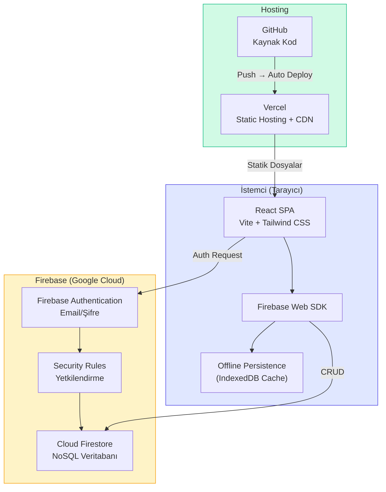
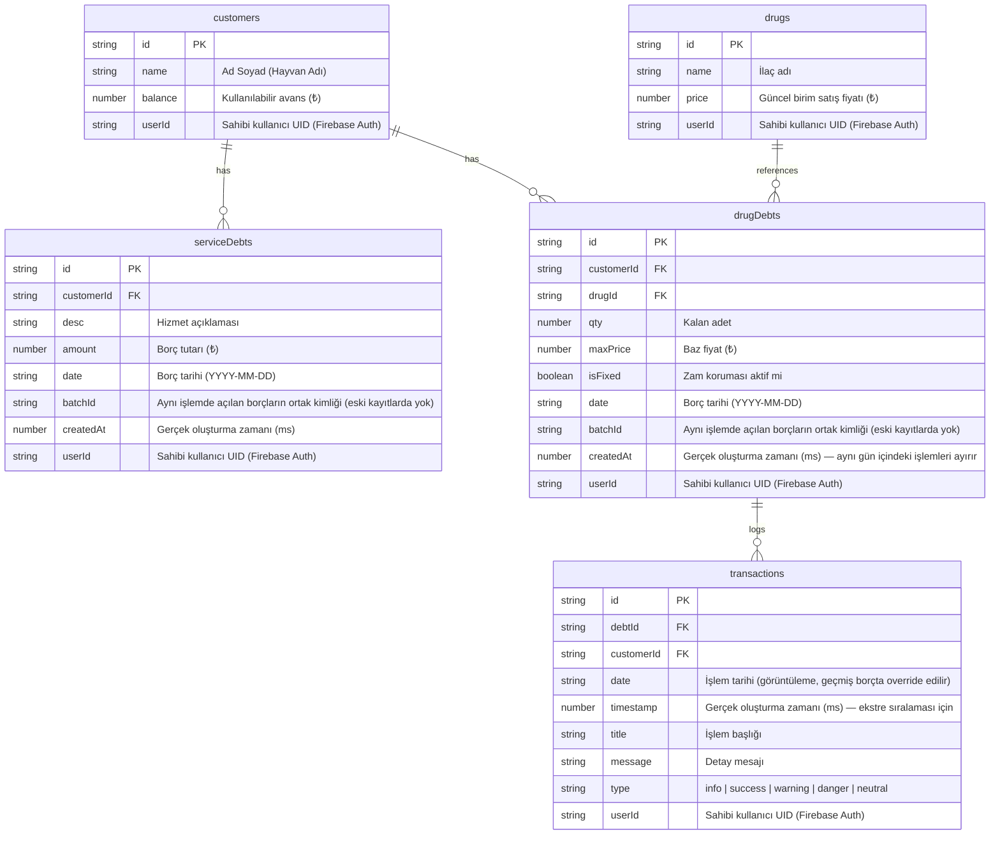
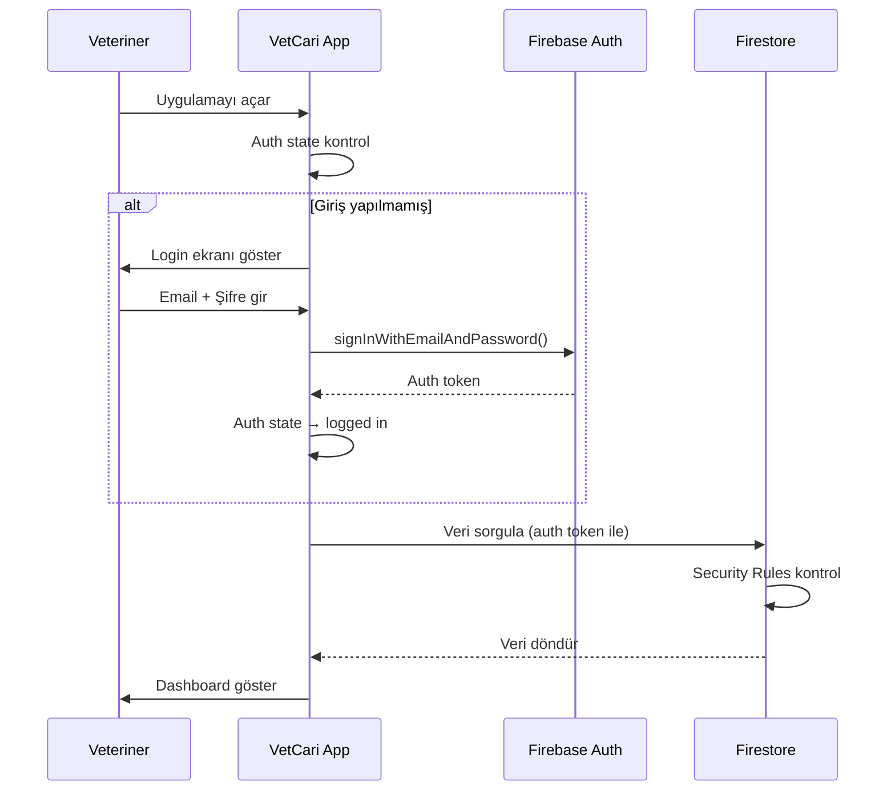
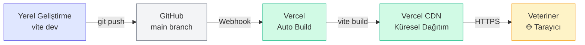

# VetCari Akıllı Defter — Mimari Dokümanı

> **Sürüm:** 1.6  
> **Son güncelleme:** 12 Nisan 2026  
> **Durum:** Geliştirme aşamasında (Faz 10+ tamamlandı, TypeScript migrasyonu ve Faz 11 planlama)

---

## 1. Projeye Genel Bakış

VetCari, veteriner klinikleri için geliştirilmiş **cari hesap takip** uygulamasıdır.  
Temel amacı müşteri borç/alacak yönetimini dijitalleştirmek ve **enflasyon korumalı ilaç borç takibi** sağlamaktır.

### Mevcut Özellikler
- Müşteri cari hesap yönetimi (borç/alacak/avans)
- Enflasyon korumalı ilaç borç takibi (fiyat sabitleme, otomatik güncelleme)
- Hizmet borçları (sabit TL cinsinden)
- Akıllı tahsilat dağıtım sistemi (önce hizmet → sonra ilaç oransal)
- Süpürücü mekanizması (10 TL altı küsüratları otomatik silme)
- İlaç iade yönetimi (fazla iade → avansa çevirme)
- Borç bazlı işlem geçmişi (ekstre/timeline)
- Geçmiş tarihli borç girişi (özel fiyat, kısmi tahsilat, enflasyon seçeneği)
- Toplu ilaç borcu ekleme (tek seferde N ilaç, orantılı tahsilat dağıtımı)
- Çok kullanıcı desteği (her kullanıcı kendi izole veritabanında çalışır)

### Planlanan Özellikler

**TypeScript Migrasyonu (TASK-023):** Incremental geçiş — `allowJs: true` ile başlanır, `strict: true` hedeflenir. Sıra: `src/types/index.ts` → servis → hook → context → component. Detaylar: [TASK.md](./TASK.md#task-023).

**Faz 11:**
- **Dönemsel finansal raporlama** (TASK-020): Dashboard'da tarih aralığı filtresi ile tahsilat/borç özeti
- **PDF ve CSV ekstre dışa aktarma** (TASK-021): Müşteriye yazılı hesap özeti üretme (`@react-pdf/renderer` + `Blob`)
- **İlaç stok takibi** (TASK-022): `drugs` koleksiyonuna `stock`/`minStock` alanı, otomatik düşüm, kritik eşik uyarısı

---

## 2. İş Kuralları ve Algoritmalar

### Borç Tipleri

| Tip | Birim | Enflasyona Duyarlı | Canlı Hesaplama |
|-----|-------|---------------------|------------------|
| **Hizmet Borcu** | Sabit TL | ❌ Hayır | İşlem anındaki tutar korunur |
| **İlaç Borcu** | Adet / Kutu | ✅ Evet | `Güncel Borç = Kalan Adet × İlacın Güncel Fiyatı` |

### Fiyat Güncelleme Kuralları

- İlaç fiyatı **artırıldığında:** Sabitlenmemiş (kilitli olmayan) tüm ilaç borçlarının `maxPrice` değeri güncellenir, ekstre'ye "Zam" logu yazılır
- İlaç fiyatı **düşürüldüğünde:** Mevcut borçlar etkilenmez — `maxPrice` baz alınır (veteriner lehine iş kuralı)
- **Sabitlenmiş (kilitli)** borçlar: Hiçbir fiyat değişikliğinden etkilenmez

### Şelale (Waterfall) Tahsilat Algoritması

1. Kasaya giren tutar + müşterinin mevcut avansı bir **havuza** toplanır
2. **Adım 1:** Önce tüm sabit hizmet borçları sırayla kapatılır
3. **Adım 2:** Kalan havuz, açık ilaç borçlarına TL büyüklükleri oranında **oransal** dağıtılır
4. Sistem otomatik dağıtım önerisi sunar, veteriner dağıtım rakamlarını **manuel override** edebilir
5. İşlem sonrası kalan para müşteriye **avans** olarak yazılır

Her iki borç tipi (hizmet ve ilaç) için de tahsilat işlemi sırasında `Tahsilat` transaction logu yazılır. Süpürücü devreye girdiğinde ek bir `Süpürücü (Kapatıldı)` logu oluşturulur.

### Süpürücü (Sweeper) Algoritması

Tahsilat veya iade sonrası bir borcun güncel TL karşılığı **≤ 10 TL** ise:
- Sistem bu borcu mikro küsurat kabul eder ve **otomatik siler**
- Ekstre'ye "Süpürücü (Kapatıldı)" logu yazılır

### İade Kuralları

| Senaryo | Sonuç |
|---------|-------|
| İade adeti **≤** mevcut borç | Borçtan düşülür |
| İade adeti **>** mevcut borç | Borç kapatılır, fazla kısım `Fazla Adet × Güncel Fiyat` formülüyle **avansa** çevrilir |

### İlaç Silme Kuralı

- Aktif ilaç borcu olan ilaçlar **silinemez** (kullanıcıya uyarı gösterilir)
- Yalnızca hiçbir müşteride borcu kalmamış ilaçlar silinebilir

### Geçmiş Tarihli Borç Girişi

Veteriner geçmişte kağıt/hafızadan takip ettiği borçları sisteme girebilir:

- **Tarih geçersizleştirme (`dateOverride`):** Borç `date` alanı seçilen geçmiş tarihe yazılır; `timestamp` ise gerçek oluşturma zamanını (bugün) tutar. Ekstre görüntüsü `date`'i gösterir, sıralama `timestamp`'e göre yapılır.
- **Kısmi tahsilat:** `paidAmount > 0` ise eski birim fiyat üzerinden adet/tutar düşülür; tahsilat logunun `date`'i `paidDate` ile override edilir.
- **Enflasyon seçeneği:** `applyInflation = true` ve ilacın güncel fiyatı girilen birim fiyattan yüksekse `maxPrice` güncellenir, borç bugünkü fiyata taşınır.
- **Süpürücü:** Kısmi tahsilat sonrası kalan ≤ 10 TL ise borç otomatik silinir.

### Toplu İlaç Borcu (Bulk)

Tek işlemde birden fazla ilaç borcu eklenebilir (`addBulkDrugDebtOperations`):

- Tek `writeBatch` ile N ilaç borcu + N transaction log yazılır (atomik)
- Kısmi tahsilat toplam tutara orantılı olarak her satıra dağıtılır; son satır yuvarlama farkını alır
- Enflasyon ve süpürücü satır bazında uygulanır
- Bugün veya geçmiş tarih modunda çalışır (`date` parametresi)

### İşlem Bazlı Gruplama (batchId)

Bir ziyarette girilen hizmet ve ilaç kalemleri **tek atomik yazımda** açılır ve ortak bir `batchId` + `createdAt` taşır. Bu sayede "bu borçlar aynı işlemde açıldı" bilgisi kalıcılaşır.

- **Tek giriş noktası:** `addDebtTransactionOperations(customerId, { date, service, drugItems, drugPaidAmount, drugPaidDate, applyInflation }, userId)`. Yazım mantıkları `appendServiceDebtToBatch` / `appendDrugItemsToBatch` yardımcılarında; her biri kendi bölümünü bağımsız doğrular, geçersiz hizmet girişi geçerli ilaç kalemlerini engellemez. Hiçbiri yazmazsa commit edilmez
- **Gruplama:** `groupDebtsByBatch(serviceDebts, drugDebts)` (`utils/debtGrouping.js`) saf fonksiyonu; anahtar `batchId || \`${type}:${doc.id}\``. Tip öneki, iki koleksiyonun doküman id'lerinin çakışmasını engeller
- **Kalem tipi:** Her kalem `type: 'service' | 'drug'` taşır; `hasFixed` / `allFixed` yalnızca ilaç kalemleri üzerinden hesaplanır
- **Geriye dönük uyumluluk:** `batchId` alanı olmayan eski kayıtlar tek kalemlik gruplara düşer — migration gerekmez
- **Sıralama:** Gruplar `date` desc, aynı tarihte `createdAt` desc
- **Grup operasyonları:** `toggleBatchLockOperations` (hepsi sabitse tümünü serbest bırakır, aksi halde tümünü sabitler; yalnızca durumu değişen kalemlere log yazar) ve `returnBatchOperations` (kalem seçimli toplu iade; avanslar birikimli hesaplanıp tek `customers` update'i yazılır). İkisi de yalnızca ilaç kalemleri için anlamlıdır — hizmet borcu iade edilmez, `deleteServiceDebtOperations` ile iptal edilir
- **Ortak iade mantığı:** Tekli (`returnDrug`) ve toplu iade aynı `applyReturnToBatch` yardımcısını kullanır — süpürücü ve fazla iade kuralları çatallanmaz
- **Görünüm:** CustomerDetail'de tek "İşlemler" listesi, katlanabilir kart (varsayılan kapalı), kalem satırı `type`'a göre dallanır; HistoryModal'da `variant='batch'` işlem ekstresi; genel ekstrede işlem başlıkları; PaymentModal'da grup başlıklı dağıtım tablosu
- **Tahsilat kısıtı:** PaymentModal'daki gruplama yalnızca render katmanındadır. Şelale önce tüm hizmet borçlarını, sonra ilaçları kapatmaya devam eder. Otomatik dağıtım dizi sırasına göre yuvarlama artığı taşıdığı için `distribution` hesabı, `extreDDebts` sırası ve `manualOverrides` anahtarları değiştirilmez; satırlar id üzerinden okunur

### Ekstre Sıralama Kuralı

Ekstre her zaman `timestamp` alanına göre azalan sırada (`desc`) gösterilir:
- Aynı gün içinde dahi sonraki işlem üstte yer alır (LIFO)
- `dateOverride` ile görüntülenen tarih farklı olsa bile sıralama `timestamp` ile belirlenir

### Performans: Memoize Stratejisi

`App.jsx`'te `CustomerProvider` value'su `useMemo` ile oluşturulur:
- Transaction'lar seçili müşteriye göre pre-filter edilir (tüm müşterilerin logları yerine)
- 7 handler fonksiyonu `useCallback` ile sarılır → stabil referanslar sağlanır
- `ToastContext`'te `toast` objesi ve context value `useMemo` ile stabilize edilmiştir
- Sonuç: CustomerDetail ve alt bileşenleri yalnızca gerçek veri değişikliklerinde yeniden render alır

---

## 3. Mimari Diyagram



---

## 4. Teknoloji Yığını (Tech Stack)

| Katman | Teknoloji | Sürüm | Amaç |
|--------|-----------|-------|------|
| **UI Framework** | React | 19.x | Bileşen bazlı kullanıcı arayüzü |
| **Build Tool** | Vite | 8.x | Hızlı geliştirme ortamı ve bundling |
| **Stil** | Tailwind CSS | 3.4.x | Utility-first CSS framework |
| **İkonlar** | Lucide React | 1.6.x | SVG ikon kütüphanesi |
| **Veritabanı** | Cloud Firestore | — | NoSQL, gerçek zamanlı, offline destekli |
| **Kimlik Doğrulama** | Firebase Auth | — | Email/şifre tabanlı giriş |
| **Hosting** | Vercel | — | Otomatik CI/CD, CDN, SSL |
| **Kaynak Kontrol** | GitHub | — | Git tabanlı sürüm yönetimi |

---

## 5. Mevcut Dosya Yapısı

Aşağıdaki yapı depodaki gerçek düzenle uyumludur (giriş `Login.jsx` / `useAuth`; tüm Firestore yazımları `firestoreOperations.js`).

```
vetcari-app/
├── public/
│   └── favicon.svg
├── src/
│   ├── components/
│   │   ├── auth/
│   │   │   └── Login.jsx            # E-posta/şifre girişi
│   │   ├── layout/
│   │   │   └── Header.jsx           # Sekme navigasyonu
│   │   ├── dashboard/
│   │   │   └── DashboardView.jsx    # Özet ve top borçlular
│   │   ├── customers/
│   │   │   ├── CustomersView.jsx    # Müşteri listesi + CRUD
│   │   │   └── CustomerDetail.jsx   # Ekstre; ilaç iadesi (inline modal)
│   │   ├── drugs/
│   │   │   └── DrugsView.jsx        # İlaç envanter / fiyat
│   │   ├── modals/
│   │   │   ├── DebtModal.jsx        # Borç ekleme (mode='today'/'past', hizmet+ilaç sekmeleri, toplu satır)
│   │   │   ├── PaymentModal.jsx     # Tahsilat (waterfall)
│   │   │   └── HistoryModal.jsx     # Borç işlem geçmişi
│   │   └── ui/
│   │       ├── ConfirmModal.jsx
│   │       ├── Toast.jsx
│   │       └── ToastContainer.jsx
│   │
│   ├── contexts/
│   │   ├── ToastContext.jsx          # Toast + async confirm (Provider, memoize edilmis)
│   │   └── CustomerContext.jsx       # Musteri detay verileri + handler'lar (Provider)
│   │
│   ├── hooks/
│   │   ├── useAuth.js
│   │   ├── useFirestore.js           # onSnapshot hata callback'li (baglanti duserse spinner durur)
│   │   ├── useToast.js
│   │   └── useCustomer.js            # CustomerContext sarmalayici hook
│   │
│   ├── services/
│   │   ├── firebase.js                     # Firebase init, offline cache
│   │   ├── firestoreOperations.js          # Tüm Firestore CRUD + batch
│   │   └── firestoreOperations.test.js     # Business logic unit testleri (Vitest)
│   │
│   ├── test/
│   │   ├── firebaseMock.js          # Firestore mock (writeBatch, addDoc, vb.)
│   │   └── setup.js                 # Vitest global setup
│   │
│   ├── utils/
│   │   ├── formatters.js
│   │   └── formatters.test.js       # Formatlayıcı unit testleri (Vitest)
│   │
│   ├── App.jsx                      # activeTab ile sekme yönetimi
│   ├── main.jsx
│   └── index.css
│
├── docs/                            # ARCHITECTURE, ROADMAP, TASK, DEPLOYMENT
├── scripts/
│   ├── backupFirestore.js           # Firestore export scripti (Node.js + Admin SDK)
│   └── migrateUserId.js             # userId migration scripti (TASK-014)
├── index.html
├── tailwind.config.js
├── vite.config.js
├── eslint.config.js
└── package.json
```

---

## 6. Firestore Veri Modeli

### Koleksiyon Yapısı



### Firestore Yolu Haritası

```
/customers/{customerId}
/drugs/{drugId}
/serviceDebts/{debtId}          → customerId + userId alanları ile filtreleme
/drugDebts/{debtId}             → customerId + drugId + userId alanları ile filtreleme
/transactions/{transactionId}   → debtId + userId alanları ile filtreleme
```

> **Not:** Alt koleksiyon (subcollection) yerine düz (flat) yapı tercih edilmiştir.  
> Nedeni: Dashboard'da tüm borçları tek seferde çekmek gerekiyor — alt koleksiyonlarda bu "collection group query" gerektirir ve daha karmaşıktır.

### Firestore Sorgu Notları

- `transactions` koleksiyonu `where('userId', '==', uid)` + `orderBy('timestamp', 'desc')` sorgusu kullanır. Bu **composite index** gerektirir — Firebase Console'dan oluşturulması gerekir.
- Diğer 4 koleksiyon (`customers`, `drugs`, `serviceDebts`, `drugDebts`) yalnızca `where('userId', '==', uid)` ile sorgulanır, tek alan index yeterlidir.

---

## 7. Kimlik Doğrulama (Authentication) Akışı



### Güvenlik Kuralları (Security Rules)

Her doküman `userId` alanı taşır. Okuma/yazma yalnızca token'daki `uid` ile dokümanın `userId`'si eşleştiğinde izin verilir. Uygulama içinde kayıt ekranı olmadığından yalnızca Firebase Console'dan eklenen kullanıcılar giriş yapabilir.

```javascript
rules_version = '2';
service cloud.firestore {
  match /databases/{database}/documents {
    match /{collection}/{docId} {
      allow read, update, delete: if request.auth != null
        && request.auth.uid == resource.data.userId;
      allow create: if request.auth != null
        && request.auth.uid == request.resource.data.userId;
    }
  }
}
```

> **Not:** Her kullanıcı yalnızca kendi oluşturduğu müşteri/ilaç/borç verilerine erişebilir. İzolasyon Firestore Security Rules + `userId` filtreli `onSnapshot` sorguları ile çift katmanlı olarak sağlanmaktadır (TASK-014).

---

## 8. Offline Erişim Stratejisi

Veteriner kırsal bölgelerde internet erişimi olmadan da çalışabilmelidir.

```javascript
// firebase.js — Offline persistence aktifleştirme
import { initializeFirestore, persistentLocalCache } from 'firebase/firestore';

const db = initializeFirestore(app, {
  localCache: persistentLocalCache()
});
```

### Davranış

| Durum | Ne Olur |
|-------|---------|
| **Online** | Veriler anında Firestore'a yazılır, gerçek zamanlı sync |
| **Offline** | Veriler yerel IndexedDB cache'e yazılır, UI normal çalışmaya devam eder |
| **Tekrar Online** | Bekleyen değişiklikler otomatik olarak Firestore'a gönderilir |

---

## 9. Deploy Pipeline



### Vercel Yapılandırması

```json
{
  "buildCommand": "npm run build",
  "outputDirectory": "dist",
  "framework": "vite"
}
```

### Ortam Değişkenleri (Vercel'de Tanımlanacak)

```env
VITE_FIREBASE_API_KEY=...
VITE_FIREBASE_AUTH_DOMAIN=...
VITE_FIREBASE_PROJECT_ID=...
VITE_FIREBASE_STORAGE_BUCKET=...
VITE_FIREBASE_MESSAGING_SENDER_ID=...
VITE_FIREBASE_APP_ID=...
```

> **Güvenlik Notu:** Firebase config değerleri client-side olduğu için aslında "gizli" değildir.  
> Gerçek güvenlik Firestore Security Rules ile sağlanır. Ancak `.env` kullanmak  
> yine de iyi bir pratiktir — farklı ortamlar (dev/prod) arasında kolay geçiş sağlar.

---

## 10. Maliyet Analizi

| Hizmet | Ücretsiz Limit | Bu Proje Kullanımı | Maliyet |
|--------|---------------|---------------------|---------|
| **Firestore** | 50K okuma / 20K yazma / gün | ~100-200 işlem / gün | **0 ₺** |
| **Firebase Auth** | 10K kullanıcı | 1 kullanıcı | **0 ₺** |
| **Vercel Hosting** | 100 GB bant genişliği / ay | ~50 MB / ay | **0 ₺** |
| **GitHub** | Sınırsız public/private repo | 1 repo | **0 ₺** |
| **SSL Sertifikası** | Vercel otomatik sağlar | — | **0 ₺** |
| **Domain (Opsiyonel)** | — | `.com` veya `.app` | **~300-400 ₺/yıl** |
| | | **TOPLAM** | **0 ₺** |

---

## 11. Uygulama Yol Haritası

> Yol haritası ayrı bir dosyada tutulmaktadır: [ROADMAP.md](./ROADMAP.md)
