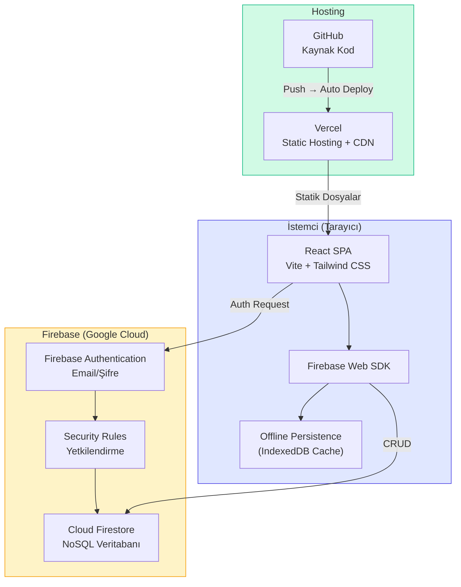
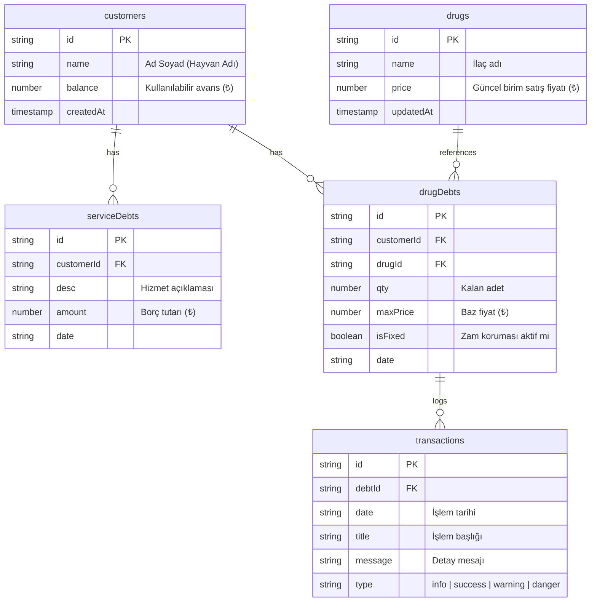
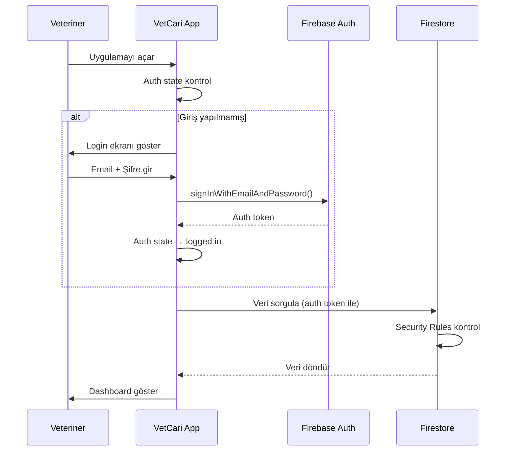
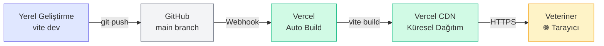

# VetCari Akıllı Defter — Mimari Dokümanı

> **Sürüm:** 1.0  
> **Son güncelleme:** 25 Mart 2026  
> **Durum:** Geliştirme aşamasında

---

## 1. Projeye Genel Bakış

VetCari, veteriner klinikleri için geliştirilmiş **cari hesap takip** uygulamasıdır.  
Temel amacı müşteri borç/alacak yönetimini dijitalleştirmek ve **enflasyon korumalı ilaç borç takibi** sağlamaktır.

### Temel Özellikler
- Müşteri cari hesap yönetimi (borç/alacak/avans)
- Enflasyon korumalı ilaç borç takibi (fiyat sabitleme, otomatik güncelleme)
- Hizmet borçları (sabit TL cinsinden)
- Akıllı tahsilat dağıtım sistemi (önce hizmet → sonra ilaç oransal)
- Süpürücü mekanizması (10 TL altı küsüratları otomatik silme)
- İlaç iade yönetimi (fazla iade → avansa çevirme)
- Borç bazlı işlem geçmişi (ekstre/timeline)

---

## 2. İş Kuralları ve Algoritmalar

### Borç Tipleri

| Tip | Birim | Enflasyona Duyarlı | Canlı Hesaplama |
|-----|-------|---------------------|------------------|
| **Hizmet Borcu** | Sabit TL | ❌ Hayır | İşlem anındaki tutar korunur |
| **İlaç Borcu** | Adet / Kutu | ✅ Evet | `Güncel Borç = Kalan Adet × İlacın Güncel Fiyatı` |

### Fiyat Güncelleme Kuralları

- İlaç fiyatı **artırıldığında:** Sabitlenmemiş (kilitli olmayan) tüm ilaç borçlarının `maxPrice` değeri güncellenir, ekstre'ye "Zam" logu yazılır
- İlaç fiyatı **düşürüldüğünde:** Mevcut borçlar etkilenmez — `maxPrice` baz alınır (veteriner lehine iş kuralı)
- **Sabitlenmiş (kilitli)** borçlar: Hiçbir fiyat değişikliğinden etkilenmez

### Şelale (Waterfall) Tahsilat Algoritması

1. Kasaya giren tutar + müşterinin mevcut avansı bir **havuza** toplanır
2. **Adım 1:** Önce tüm sabit hizmet borçları sırayla kapatılır
3. **Adım 2:** Kalan havuz, açık ilaç borçlarına TL büyüklükleri oranında **oransal** dağıtılır
4. Sistem otomatik dağıtım önerisi sunar, veteriner dağıtım rakamlarını **manuel override** edebilir
5. İşlem sonrası kalan para müşteriye **avans** olarak yazılır

### Süpürücü (Sweeper) Algoritması

Tahsilat veya iade sonrası bir borcun güncel TL karşılığı **≤ 10 TL** ise:
- Sistem bu borcu mikro küsurat kabul eder ve **otomatik siler**
- Ekstre'ye "Süpürücü (Kapatıldı)" logu yazılır

### İade Kuralları

| Senaryo | Sonuç |
|---------|-------|
| İade adeti **≤** mevcut borç | Borçtan düşülür |
| İade adeti **>** mevcut borç | Borç kapatılır, fazla kısım `Fazla Adet × Güncel Fiyat` formülüyle **avansa** çevrilir |

### İlaç Silme Kuralı

- Aktif ilaç borcu olan ilaçlar **silinemez** (kullanıcıya uyarı gösterilir)
- Yalnızca hiçbir müşteride borcu kalmamış ilaçlar silinebilir

---

## 3. Mimari Diyagram



---

## 4. Teknoloji Yığını (Tech Stack)

| Katman | Teknoloji | Sürüm | Amaç |
|--------|-----------|-------|------|
| **UI Framework** | React | 19.x | Bileşen bazlı kullanıcı arayüzü |
| **Build Tool** | Vite | 8.x | Hızlı geliştirme ortamı ve bundling |
| **Stil** | Tailwind CSS | 3.4.x | Utility-first CSS framework |
| **İkonlar** | Lucide React | 1.6.x | SVG ikon kütüphanesi |
| **Veritabanı** | Cloud Firestore | — | NoSQL, gerçek zamanlı, offline destekli |
| **Kimlik Doğrulama** | Firebase Auth | — | Email/şifre tabanlı giriş |
| **Hosting** | Vercel | — | Otomatik CI/CD, CDN, SSL |
| **Kaynak Kontrol** | GitHub | — | Git tabanlı sürüm yönetimi |

---

## 5. Hedef Dosya Yapısı

Mevcut tek dosya yapısından aşağıdaki modüler yapıya geçiş planlanmaktadır:

```
vetcari-app/
├── public/
│   └── favicon.svg
├── src/
│   ├── components/                  # UI Bileşenleri
│   │   ├── layout/
│   │   │   ├── Header.jsx           # Navigasyon çubuğu
│   │   │   └── Layout.jsx           # Ana sayfa düzeni
│   │   ├── dashboard/
│   │   │   └── DashboardView.jsx    # Ana sayfa / sistem özeti
│   │   ├── customers/
│   │   │   ├── CustomersView.jsx    # Müşteri listesi
│   │   │   └── CustomerDetail.jsx   # Müşteri detay (ekstre)
│   │   ├── drugs/
│   │   │   └── DrugsView.jsx        # İlaç & fiyat listesi
│   │   └── modals/
│   │       ├── PaymentModal.jsx     # Tahsilat dağıtım ekranı
│   │       ├── HistoryModal.jsx     # Borç geçmişi (ekstre)
│   │       └── ReturnModal.jsx      # İade alma
│   │
│   ├── hooks/                       # Özel React Hooks
│   │   ├── useAuth.js               # Firebase auth yönetimi
│   │   └── useFirestore.js          # Firestore CRUD operasyonları
│   │
│   ├── services/                    # Firebase Servisleri
│   │   ├── firebase.js              # Firebase başlatma (config)
│   │   ├── auth.js                  # Giriş/çıkış fonksiyonları
│   │   └── db.js                    # Firestore okuma/yazma
│   │
│   ├── utils/                       # Yardımcı Fonksiyonlar
│   │   └── formatters.js            # fmtTL(), fmtQty() vb.
│   │
│   ├── App.jsx                      # Router + Layout (sadece iskelet)
│   ├── main.jsx                     # React root
│   └── index.css                    # Tailwind direktifleri
│
├── docs/ARCHITECTURE.md             # Bu dosya
├── index.html
├── tailwind.config.js
├── vite.config.js
└── package.json
```

---

## 6. Firestore Veri Modeli

### Koleksiyon Yapısı



### Firestore Yolu Haritası

```
/customers/{customerId}
/drugs/{drugId}
/serviceDebts/{debtId}          → customerId alanı ile filtreleme
/drugDebts/{debtId}             → customerId + drugId alanları ile filtreleme
/transactions/{transactionId}   → debtId alanı ile filtreleme
```

> **Not:** Alt koleksiyon (subcollection) yerine düz (flat) yapı tercih edilmiştir.  
> Nedeni: Dashboard'da tüm borçları tek seferde çekmek gerekiyor — alt koleksiyonlarda bu "collection group query" gerektirir ve daha karmaşıktır.

---

## 7. Kimlik Doğrulama (Authentication) Akışı



### Güvenlik Kuralları (Security Rules)

```javascript
rules_version = '2';
service cloud.firestore {
  match /databases/{database}/documents {

    // Yalnızca tanımlı veteriner e-postası erişebilir
    function isOwner() {
      return request.auth != null 
        && request.auth.token.email == 'veteriner@email.com';
    }

    match /customers/{docId} {
      allow read, write: if isOwner();
    }
    match /drugs/{docId} {
      allow read, write: if isOwner();
    }
    match /serviceDebts/{docId} {
      allow read, write: if isOwner();
    }
    match /drugDebts/{docId} {
      allow read, write: if isOwner();
    }
    match /transactions/{docId} {
      allow read, write: if isOwner();
    }
  }
}
```

---

## 8. Offline Erişim Stratejisi

Veteriner kırsal bölgelerde internet erişimi olmadan da çalışabilmelidir.

```javascript
// firebase.js — Offline persistence aktifleştirme
import { initializeFirestore, persistentLocalCache } from 'firebase/firestore';

const db = initializeFirestore(app, {
  localCache: persistentLocalCache()
});
```

### Davranış

| Durum | Ne Olur |
|-------|---------|
| **Online** | Veriler anında Firestore'a yazılır, gerçek zamanlı sync |
| **Offline** | Veriler yerel IndexedDB cache'e yazılır, UI normal çalışmaya devam eder |
| **Tekrar Online** | Bekleyen değişiklikler otomatik olarak Firestore'a gönderilir |

---

## 9. Deploy Pipeline



### Vercel Yapılandırması

```json
{
  "buildCommand": "npm run build",
  "outputDirectory": "dist",
  "framework": "vite"
}
```

### Ortam Değişkenleri (Vercel'de Tanımlanacak)

```env
VITE_FIREBASE_API_KEY=...
VITE_FIREBASE_AUTH_DOMAIN=...
VITE_FIREBASE_PROJECT_ID=...
VITE_FIREBASE_STORAGE_BUCKET=...
VITE_FIREBASE_MESSAGING_SENDER_ID=...
VITE_FIREBASE_APP_ID=...
```

> **Güvenlik Notu:** Firebase config değerleri client-side olduğu için aslında "gizli" değildir.  
> Gerçek güvenlik Firestore Security Rules ile sağlanır. Ancak `.env` kullanmak  
> yine de iyi bir pratiktir — farklı ortamlar (dev/prod) arasında kolay geçiş sağlar.

---

## 10. Maliyet Analizi

| Hizmet | Ücretsiz Limit | Bu Proje Kullanımı | Maliyet |
|--------|---------------|---------------------|---------|
| **Firestore** | 50K okuma / 20K yazma / gün | ~100-200 işlem / gün | **0 ₺** |
| **Firebase Auth** | 10K kullanıcı | 1 kullanıcı | **0 ₺** |
| **Vercel Hosting** | 100 GB bant genişliği / ay | ~50 MB / ay | **0 ₺** |
| **GitHub** | Sınırsız public/private repo | 1 repo | **0 ₺** |
| **SSL Sertifikası** | Vercel otomatik sağlar | — | **0 ₺** |
| **Domain (Opsiyonel)** | — | `.com` veya `.app` | **~300-400 ₺/yıl** |
| | | **TOPLAM** | **0 ₺** |

---

## 11. Uygulama Yol Haritası

> Yol haritası ayrı bir dosyada tutulmaktadır: [ROADMAP.md](./ROADMAP.md)
